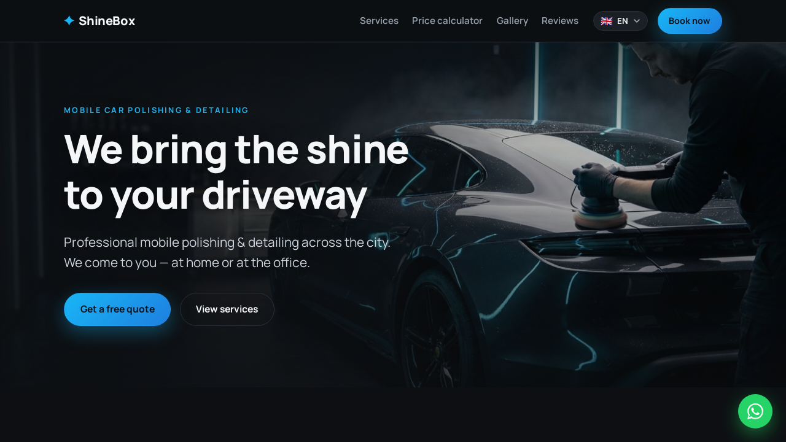
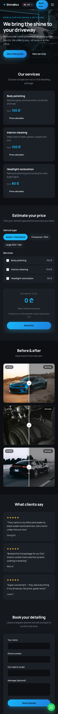
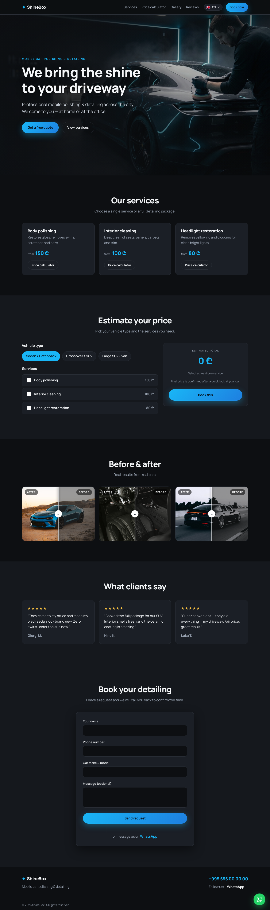

# ShineBox — Car Detailing Landing Page 🚗✨

> A bilingual **(English / Georgian)** one-page WordPress site for **ShineBox**, a mobile car polishing & detailing service that comes to the client.

<p align="center">
  
  
  
  
  
  
</p>

<p align="center">
  
</p>

---

## ✨ Features

- 📄 **One-page responsive design** — modern dark, "glossy" look.
- 🌐 **Bilingual EN / KA** — flag **dropdown** language switcher, SEO-friendly separate URLs (`/` and `/ka/`) via **Polylang** with automatic `hreflang`. Falls back to a built-in translation layer if Polylang is disabled.
- 🧴 **Services & pricing** — body polishing, interior cleaning, headlight restoration (single source of truth in `inc/pricing.php`).
- 🧮 **Interactive price calculator** — total = selected services × vehicle-type multiplier.
- 🖼️ **Before / after gallery** — drag-to-compare sliders.
- 📩 **Booking form** — Name + Phone + Car model, sent to email via AJAX.
- 💬 **Floating WhatsApp button** + click-to-chat links.
- 🎨 **Photoreal hero image** generated with Google's Gemini image model.
- ♿ Respects `prefers-reduced-motion`.

---

## 📸 Screenshots

<table>
  <tr>
    <td width="50%"><b>English — <code>/</code></b><br></td>
    <td width="50%"><b>Georgian — <code>/ka/</code></b><br></td>
  </tr>
</table>

<table>
  <tr>
    <td width="32%"><b>Mobile</b><br></td>
    <td width="68%"><b>Full page</b><br></td>
  </tr>
</table>

---

## 🧱 Tech stack

| Area | Tools |
|------|-------|
| CMS | WordPress (custom theme, **no page builder**) |
| Back-end | PHP 8 |
| Front-end | Vanilla JavaScript · CSS (no build step) |
| Multilingual | Polylang + built-in `inc/i18n.php` layer |
| Environment | Docker + Docker Compose |

---

## 🚀 Local setup (Docker)

```bash
docker compose up -d        # WordPress on http://localhost:8090
docker compose down         # stop
docker compose down -v      # stop and wipe the database
```

Then open `http://localhost:8090`, finish the WordPress install, and activate the **ShineBox** theme under *Appearance → Themes*. The theme is mounted into the container, so file edits are live without rebuilding.

---

## 📁 Theme structure

```
wp-content/themes/shinebox/
├── functions.php            # assets, theme support, JS localization
├── header.php / footer.php  # header (nav + language dropdown) and footer
├── front-page.php           # home page — assembles the sections
├── inc/
│   ├── i18n.php             # EN/KA dictionary + helpers
│   ├── pricing.php          # car types & services (single source of truth)
│   └── contact-handler.php  # AJAX booking handler + Customizer settings
├── template-parts/          # hero, services, calculator, gallery, reviews, booking
└── assets/                  # css, js, images
```

---

## ⚙️ Configuration

Contact details (email, phone, WhatsApp, social links) are set under
**Appearance → Customize → ShineBox — Contact & Social**. Prices and services
live in `inc/pricing.php`; all UI text lives in `inc/i18n.php`.

---

## 📝 Notes

- Demo content and placeholder images are included — replace with the client's
  real photos, prices, and reviews before launch.
- To deliver email from bookings, install an SMTP plugin (e.g. *WP Mail SMTP*).

---

<p align="center">Built by <a href="https://github.com/mariatero">@mariatero</a></p>
